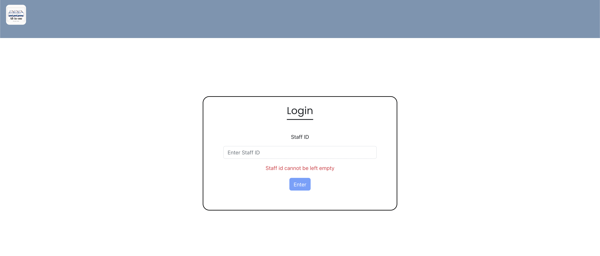
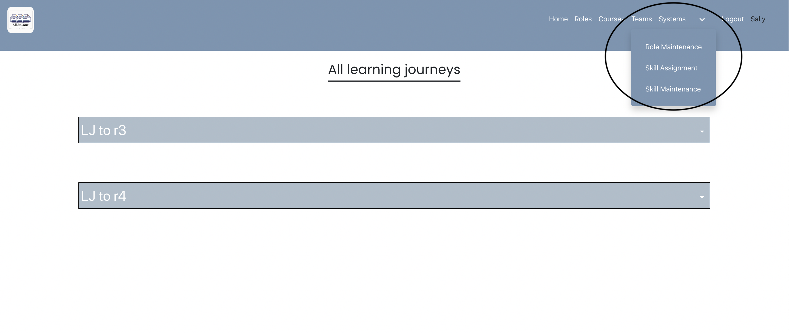

# IS212_SPM
# Getting Started with Our Project

This project was bootstrapped and created with React, NodeJS, and ExpressJS.
Our database is a relational database and uses MySQL.

### Prerequisites
You have to have your MAMP/ WAMP working, MySQL server is running.

## Database
You have to run the SPM raw data.sql file in the /database folder in your MySQL Workbench or in [phpMyAdmin](http://localhost/phpmyadmin/import.php) in order to populate the database.

For Mac users, ensure that the "only_full_group_by" has been removed from the sql_mode under the varaibles tab in [phpMyAdmin](http://localhost/phpmyadmin/import.php)

## Cloning of Git Repository
When you clone this Git Repository locally, be sure to install all packages with `npm i` first.

## Available Scripts

In the respective directories, you can run:

### `npm run devStart`

Runs the backend server and starts the api routes. Different from npm start because this command had nodemon built in, which allows updates to automatically restart the server to see the changes.

### `npm start`

Runs the app in the development mode.\
Open [http://localhost:5000](http://localhost:5000) to view it in the browser.

The page will reload if you make edits.\
You will also see any lint errors in the console.

### `npm test`

Launches the test runner in the interactive watch mode.\
See the section about [running tests](https://facebook.github.io/create-react-app/docs/running-tests) for more information.

Only works in the /frontend folder because that is where all our tests are. However, these tests are automatically run via CI codes.
See "Actions" in Github.

### `npm run eject`

**Note: this is a one-way operation. Once you `eject`, you can’t go back!**

If you aren’t satisfied with the build tool and configuration choices, you can `eject` at any time. This command will remove the single build dependency from your project.

Instead, it will copy all the configuration files and the transitive dependencies (webpack, Babel, ESLint, etc) right into your project so you have full control over them. All of the commands except `eject` will still work, but they will point to the copied scripts so you can tweak them. At this point you’re on your own.

You don’t have to ever use `eject`. The curated feature set is suitable for small and middle deployments, and you shouldn’t feel obligated to use this feature. However we understand that this tool wouldn’t be useful if you couldn’t customize it when you are ready for it.

### Running the backend
From the main directory, do cd /backend and then run `npm run devStart`. If you are running a Mac, be sure to enter your password in the index.js file in the backend folder.

### Running the frontend
From the main directory , do cd /frontend and then run `npm start`.

### Known Bugs
If you are running MySQL v8.0 and above on a Mac, there is an error that prevents data from being retrieved and crashes the whole database. It is something to do with the incompatibility with sql_mode=only_full_group_by. 

# Our web application
Upon visiting our website, the user will be brought to the sign in page. Currently, users are populated based on an excel file given. We will be using these 2 roles to showcase our process flow of the web application.

<u>Human Resource<u>
User ID: 160008

<u>Staff<u>
User ID: 140002

## Staff login (Login using ID: 140002)
When the user is signed in, the user will be brought directly to the homepage where he would be able to see different pages he would be able to navigate to. 2 learning journeys will be displayed based on the data.

## Roles page
The user can browse through the roles at the roles page

## Creating learning journey
User can create their learning journey by clicking the "Create Learning Journey" on the roles page and will be navigated to selection of courses

## Selecting courses
User will then select the courses he/she would like to take and pressing the "Create" button will create a new learning journey

## Course page
The user can browse through the courses at the courses page

## Updating of learning journey
User may edit the learning journey by clicking the "Update the courses in journey" button

If roles are retired, user will not be able to edit the learning journey as shown below

User will be brought to another page where they are able to add or remove courses from their learning journey

## HR Login (Login using ID: 160008)
HR are given the accessibility to create/edit/delete the roles, assign skills to courses and create/edit/delete skills

## Role Maintenance
HR are able to create/edit roles

## Skill Maintenance
HR are able to create/edit skills

## Skill Assignment
HR are able to assign skills to courses
